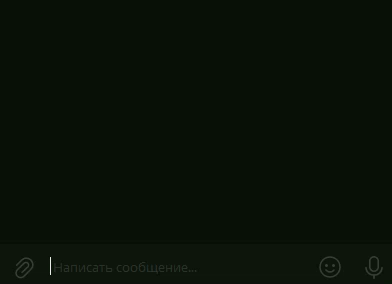
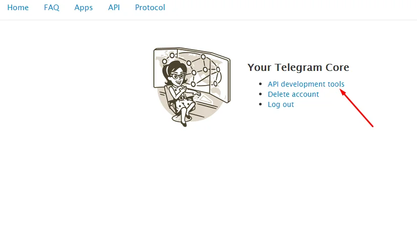
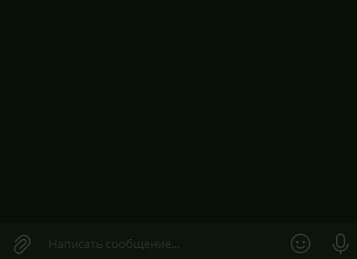

# Telegram Delete Messages
Скрипт на Python, который позволяет удалять свои сообщения в Telegram используя триггер-слово.

# Установка
Установим нужные библиотеки.

`pip install -r requirements.txt`

Если всё прошло успешно, зайдите [сюда](https://my.telegram.org/). Логинемся и создайте новое приложение(app):

Заполните форму.

Теперь мы получили api_id, api_hash. Сохраните их!

Запустите main.py. Введите данные (api_id, api_hash). Введите номер телефона, подтвердите свой выбор. Введите код подтверждения.

Бот запущен!

# Использование
Бот умеет удалять ваши последние сообщения.
Изменять триггер-слово.
## Удаление сообщений
Удаление определённого количества сообщений.

Удаление последнего сообщения.

Так же бот умеет удалять сообщение на которое вы ответили. Ответьте на сообщение и напишите в ответ триггер-слово.

## Смена триггер-слова

`нст {новое триггер-слово}`

# Помощь
За помощью обращайтесь в личку.
> [Алексей Кузнецов](https://vk.com/id194861150)
